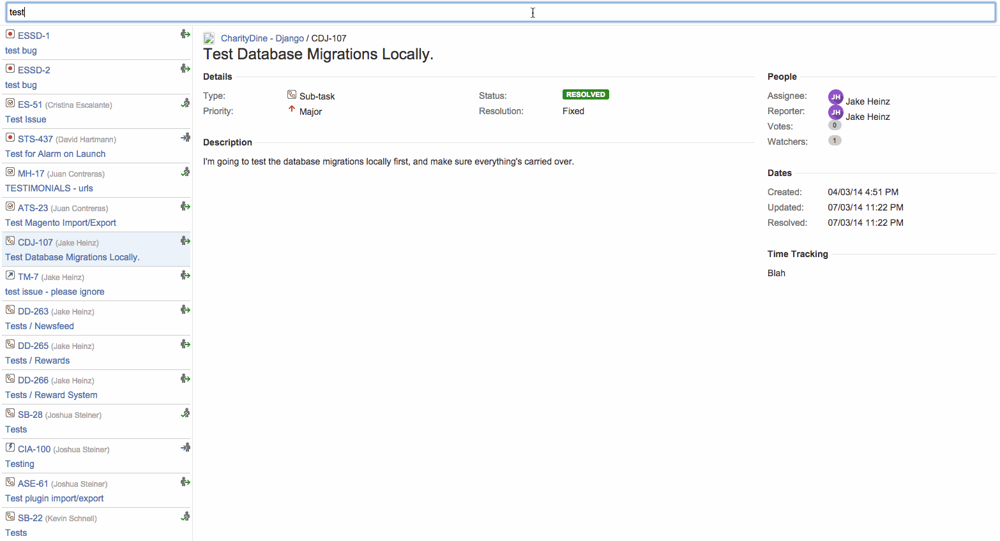

# Jeev Jira Cache

Exposes a web-server that runs an indexed redis jira cache.

More documentation will probably come soon. However, this is really just an internal module used by SilverLogic 
(https://tsl.io).

# Configuration variables

## `JEEV_JIRACACHE_OAUTH_ACCESS_TOKEN`
## `JEEV_JIRACACHE_OAUTH_ACCESS_TOKEN_SECRET`
## `JEEV_JIRACACHE_OAUTH_CONSUMER_KEY`
## `JEEV_JIRACACHE_OAUTH_JEY_CERT`
## `JEEV_JIRACACHE_SERVER`

## Installing
In your jeev directory, (the one made with `jeev init`), clone this repo

    $ git clone https://github.com/jhgg/jeev-jiracache
    
Then just add it to the config, and set the configuration variables. You should
probably refer to the python jira module documentation to generate the oauth tokens. Then just make sure
you have a redis server running locally. Once Jeev starts, tell him to resync the jiracache cache

    > jeev, resync jiracache cache
